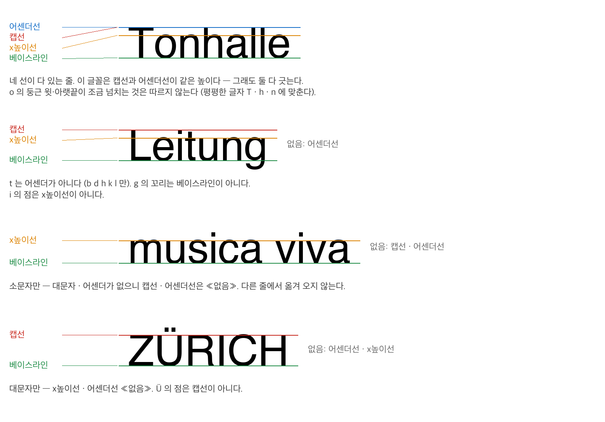

# 브로크만 포스터 선 긋기 요청서 (2026-09-14)

## 0. 한눈에

- **무엇을.** 포스터마다 먼저 타이포 덩어리(블록)에 상자를 긋는다. 그다음 블록 안의 줄마다 가로선 네 종류를 긋는다: 베이스라인 · 캡선 · 어센더선 · x높이선.
- **몇 장.** 연습 판 2장 + 본 목록 50장 (7절).
- **누가.** **송준혁과 공동 연구자** 두 사람이 같은 포스터를 **따로** 긋는다. 연습 판 2장만 같이 본다. 본 목록에서는 서로의 결과를 보지 않는다.
- **무엇으로.** 선 긋기 도구 `선긋기.html` — 파일 하나다. 더블클릭하면 브라우저에서 열린다 (8절).
- **얼마나.** 한 사람에 이틀 안팎이다 (7~12시간). 본 목록의 줄은 대략 830개, 블록은 240개쯤이다. 파이프라인이 추정한 수라 실제와 다를 수 있다.
- **보내는 것.** 도구가 저장한 `guides_…json` 파일 하나 (9절).

## 1. 이 자료가 어디에 쓰이나

프로그램이 포스터 이미지에서 잰 줄의 위치를 사람이 그은 선에 대 본다. 사람이 그은 선은 정답이 아니라 **참조**다. 그래서 두 사람이 따로 긋고, 두 사람 사이의 차이도 함께 낸다. 긋는 동안에는 프로그램이 무엇을 냈는지 보여주지 않는다.

## 2. 순서

1. **연습 판 — 같은 행을 고르는지 확인한다.** 이 확인이 끝나기 전에는 본 목록을 시작하지 않는다.
   1. 두 사람이 연습 판 2장을 **각자 따로** 긋는다. 도구 첫 화면의 «연습 판» 에서, 본 목록과 똑같이 긋는다.
   2. 두 사람의 파일을 견준다:
      `.venv/bin/python docs/labeling/compare_guides.py guides_A.json guides_B.json --set practice --out 연습비교.json`
      선 종류마다 «같은 행» · «±1행 이내» · «±1행 넘음» 과, 한쪽만 그었거나 표시가 다른 칸이 나온다.
   3. 어긋난 자리를 두 사람이 **같이** 화면에서 본다.
      - ±1행을 넘는 차이는 모두 까닭을 찾는다. 까닭은 선 종류 착각 · 블록 나누기 · 흐린 행 판단(6절) · 크기 섞임(5절 7) 같은 것이다.
      - 까닭을 규칙으로 적어 «덧붙인 조항» 에 넣는다.
      - «없음» · «못 가림» 이 갈린 칸도 같은 방법으로 맞춘다.
   4. 조항을 더했으면 연습 판을 **다시 따로** 긋고 2 로 돌아간다. ±1행을 넘는 차이에 설명되지 않는 것이 남지 않으면 끝낸다.
   5. **±1행 차이는 없애려 하지 않는다.** 도구를 검증할 때 정답을 아는 합성 포스터에서도 x높이선을 1행 아래로 고른 사례가 있었다. 흐린 가장자리 행을 어떻게 읽느냐에 따라 생기는 차이다. 이 크기가 두 사람 일치도의 하한이다. 연습 판 파일과 비교 결과는 모두 보관해, 본 목록의 일치도와 함께 보고한다.
2. **본 목록.** 여기서부터는 **따로** 한다. 포스터마다:
   1. 블록 상자를 모두 긋는다 (3절).
   2. 블록을 하나 고르고, 그 안의 줄마다 네 선을 긋거나 «없음» · «못 가림» 을 표시한다 (4 · 5절).
   3. 빈칸이 없으면 «이 포스터 끝» 을 누르고 다음 포스터로 간다.
3. 하루가 끝날 때마다, 그리고 다 끝나면 파일로 저장한다 (9절).

**왜 블록부터 긋나.** 가로선만 그으면 같은 높이에 놓인 다른 단의 블록이 구분되지 않는다. 선은 자기가 속한 블록에 붙어 저장된다.

## 3. 블록 규칙

아래는 기존 사람 상자 규칙의 전문이다 (`~/Documents/poster/labeler/README.md`, 2026-08-21). 인용 안의 «상자» 가 이 문서의 «블록» 이다.

> ### 상자를 어떻게 정의하나 — 판정 규칙
>
> «눈에 보이는 덩어리» 만으로는 사람마다 다르게 찍는다. 견줄 수 있는 기준을 쓴다.
>
>     줄들이 서로 붙어 있고, 그 덩어리 둘레에 훨씬 넓은 틈이 있으면 한 덩어리.
>     안쪽 간격보다 두 배 넘게 벌어지는 자리에서 끊는다.
>
> **틈만 본다.** 크기도 정렬도 보지 않는다. 그리고 틈을 «몇 px» 로 재지 않고 **이웃한 틈끼리 견준다** — 게슈탈트의 상대적 근접이다. 같은 10px 틈도 옆이 40px 면 가깝고 옆이 3px 면 멀다. 활자 크기가 제각각인 판면에서는 이것만이 일관되게 적용된다.
>
> 딸린 조항 넷.
>
> 1. **크기는 보지 않는다.** 줄마다 크기가 달라도 붙어 있으면 한 덩어리다.
> 2. **정렬도 보지 않는다.** 다만 줄들이 **가로로 전혀 안 겹치면** 따로다 — 표에서 단이 나뉜 경우가 이것이다.
> 3. 줄이 하나뿐이어도 덩어리다.
> 4. **애매하면 끊는다.** 나중에 합칠 수는 있어도 쪼갤 수는 없다.
>
> 기준을 두 번 고쳤다. 처음에는 «같은 크기» 를 넣었다가 뺐다 — 상자가 결국 조판을 재는 단위가 되니 크기가 섞이면 곤란하다고 보았는데, 그건 분석 쪽 사정이지 라벨의 기준이 아니었다. 1961 «René Auberjonois»(호프만)처럼 크기도 정렬도 제각각인데 누가 봐도 한 덩어리인 포스터가 반례다. 여섯 줄이 서로 붙어 있고 둘레가 167px 비어 있다.
>
> ### 상자의 범위 — 잉크 전체
>
> 글자의 진짜 맨 위와 맨 아래까지. 디센더(g·y·p)와 발음기호(ä·ü·ö)를 포함한다. 검출기는 x높이에서 베이스라인까지로만 잡아 이것들을 빼먹는다.

**이번 요청에서 바뀌거나 더해지는 것.**

- 원래 규칙에는 «앞 다섯 장은 같이 보면서 맞춘다» 가 있었다. 이번에는 **목록 밖 연습 판 두 장**으로 대신한다 (2절 1). 본 목록은 처음부터 따로 긋는다.
- 블록에 표시를 하나 붙일 수 있다. 표시가 붙은 블록은 상자만 긋고 선은 긋지 않는다.
  - **«가로 아님»** — 세로나 사선으로 놓인 줄의 블록. 판 가장자리의 세로 인쇄소 · 디자이너 표기가 대개 이것이다.
  - **«활자 아님»** — 손글씨이거나 그림으로 그린 글자.
- 한 줄 안에서 크기가 다른 글자 무리가 가로로 떨어져 있으면 **따로 블록**이다 (5절 7). 조항 1(크기는 보지 않는다)은 위아래로 붙은 줄들에 대한 것이고, 조항 2(가로로 안 겹치면 따로)를 한 줄 안에도 적용한다.

## 4. 선 종류

그림은 Helvetica 글리프의 실제 위치에 선을 그은 것이다. 같은 그림이 도구 안에도 있다.

| 선 | 가리키는 자리 | 맞출 글자 | 따르지 않는 것 |
|---|---|---|---|
| **베이스라인** | 글자 몸통의 바닥 | 바닥이 평평한 글자 (H L E n i x) | 둥근 글자(o e s c)가 조금 넘쳐 내려가는 것 · 디센더(g j p q y) 꼬리 · 쉼표 |
| **x높이선** | 소문자 몸통의 윗끝 | 윗끝이 평평한 소문자 (x z v w u) | i j 의 점 · 둥근 글자(o e)의 넘침 · 어센더 |
| **캡선** | 대문자의 윗끝 | 윗끝이 평평한 대문자 (H E T Z L F). 평평한 대문자가 없고 둥근 대문자(O C G S)만 있으면 그 맨 윗끝 | 발음기호(Ä Ö Ü 의 점, É 의 악센트) · 숫자 · 소문자 어센더 |
| **어센더선** | 소문자 어센더의 윗끝 | b d h k l | t (어센더가 아니다) · f · i 의 점 · 대문자 |

- 캡선과 어센더선이 **같은 높이로 보여도 둘 다 긋는다.** 그로테스크 활자에서는 흔하다.
- 숫자로는 캡선을 긋지 않는다. 대문자가 없고 숫자만 있는 줄이면 캡선은 «없음» 이다.

## 5. 긋는 규칙

1. **줄마다 긋는다.** 같은 간격으로 되풀이되는 본문 줄도 한 줄도 빼지 않는다. 앞 줄과 간격이 같아 보여도 그 줄 글자에 맞춰 따로 긋는다.
2. **줄의 네 칸마다 셋 중 하나를 남긴다.** 빈칸이 남아 있으면 도구가 그 포스터를 «끝» 으로 넘기지 않는다.
   - **긋는다.**
   - **«없음»** — 그 줄에 해당 글자가 없다. 예: 소문자만 있는 줄의 캡선, 대문자만 있는 줄의 x높이선.
   - **«못 가림»** — 글자는 있는데 너무 작거나 흐려서 위치를 정할 수 없다.
3. **베이스라인이 줄을 만든다.** 베이스라인에는 «없음» 이 없다 — 글자가 있으면 줄이 있다. 블록 안 글자가 너무 작아 줄 하나의 베이스라인도 못 정하면, 줄을 만들지 않고 그 블록에 «못 가림» 을 준다 (8절 ⇧M).
4. **추정해서 긋지 않는다.** 다른 줄이나 다른 블록의 선을 옮겨 오지 않는다. 글꼴 비율로 계산하지 않는다. 그 줄에 보이는 글자에만 긋는다.
5. 선의 길이와 가로 위치는 신경 쓰지 않는다. 도구가 블록 폭으로 긋고, 높이(y)만 기록한다.
6. 판이 조금 기울어 한 줄의 양 끝 높이가 다르면 줄 가운데 글자에 맞춘다.
7. **한 줄에 크기가 다른 글자가 섞일 때.** 줄은 «같은 크기의 글자가 한 베이스라인에 늘어선 것» 이다.
   1. **가로로 틈을 두고 나란히 있으면 크기마다 따로 블록으로 긋는다.**
      - 예: 작은 딸림말 «leitung» 뒤의 큰 이름, 작은 이름 «carl» 옆의 큰 성, 큰 이름 뒤의 작은 «solist».
      - 작은 글자 무리가 위아래로 여러 줄이면 3절 규칙대로 그 무리가 한 블록이다.
      - 선은 블록마다 그 블록의 글자에 긋는다.
      - 틈이 낱말 사이 간격과 비슷해 애매하면 끊는다 (3절 조항 4).
   2. **작은 글자의 베이스라인이 큰 글자와 다르면 한 줄이 아니다.** 1 처럼 따로 블록으로 긋는다.
   3. **틈 없이 붙어 있어 가를 수 없으면 한 블록 · 한 줄로 둔다.**
      - 예: 한 낱말 안에서 글자 크기가 바뀌는 경우.
      - 네 선은 **가장 큰 글자**에 긋는다. 작은 글자에만 있는 선(작은 대문자의 캡선 등)은 긋지 않고, 큰 글자에 그 선이 없으면 «없음» 이다.
      - 메모 칸에 «크기 섞임 — 블록 n 줄 m» 을 적는다.

## 6. 좌표 약속

- 도구는 포스터를 **원본 픽셀 그대로** 보여준다. 줄이거나 다시 압축하지 않는다.
- 선은 **픽셀과 픽셀 사이의 경계**에 붙는다.
  - 베이스라인은 글자 잉크가 끝나는 행의 **아래** 경계다.
  - 캡선 · 어센더선 · x높이선은 잉크가 시작하는 행의 **위** 경계다.
- 가장자리의 흐린(회색) 행은 **절반 넘게 진하면 글자로 본다.** 이 판단에서 두 사람이 1행씩 갈릴 수 있다 (2절 1-5).
- 4배 이상 확대해서 긋는다. 도구가 그을 때의 배율을 함께 기록한다.

## 7. 포스터 목록

**선정 기준.** 판마다의 칸 · 예상 줄 수 · 뺀 판의 이름과 까닭은 `docs/labeling/SELECTION.md` · `selection.json` · `rotation.json` 에 있다. 라벨러는 긋는 동안 이 파일들을 열지 않는다.

- **모집단.** 브로크만 코어 123장 (`~/Documents/연구2/브로크만 정리/corpus/코어/`).
- **뺀 것 — 회전 14장.**
  - **기울어진 판 10장.** 판 전체가 돌아간 판이다. 판정은 코드가 했다: EasyOCR 넓은 상자 12개 윗변 기울기의 중앙값 |각| ≥ 14°.
  - **회전 블록이 있는 판 4장.** 판은 기울지 않았어도, 글줄이 가로가 아닌 활자 블록이 하나라도 있으면 뺐다. «가로가 아니다» 는 한 글줄의 양 끝 높이 차가 그 글자의 x높이보다 큰 경우다 (세로 · 사선 · 돌아간 카드 위의 글).
    - 판 가장자리(판 폭 · 높이의 5% 안)에 붙은 한 줄짜리 인쇄소 · 디자이너 표기와 서명은 세지 않았다. 대부분의 판에 있기 때문이다. 그런 줄은 «가로 아님» 블록으로 표시한다.
    - 판정은 Claude(claude-opus-5)의 눈 판정이다. **사람 판정이 아니다.**
- **뺀 것 — 그 밖.**
  - 줄이 아주 많은 판 16장 (파이프라인 추정 40줄 초과).
  - 같은 디자인에서 언어나 장소만 바꾼 변형 9장. 한 무리에서 한 장만 남겼다.
  - 연습 판 2장.
- **고르게 섞은 것.** 판정의 출처는 아래 «판정의 출처» 에 적었다.
  - **대문자 유무** — 대문자가 있는 판 25장 · 없는 판 25장.
  - **단 수** — 대문자 조건마다 1단과 2단 이상을 가능한 한 반반으로 했다. 모두 합하면 1단 30 · 2단+ 20이다. 대문자 없는 2단+ 후보가 8장뿐이었다.
  - 긋는 순서는 seed 20260914 로 섞었다.
- **판정의 출처.** 둘 다 사람 판정이 아니며, 선정에만 썼다.
  - **대문자 유무는 Claude 의 눈 판정이다.** 원본 해상도로 123장을 보고 붙였다. EasyOCR 와의 일치는 0.878 (κ 0.75)이다.
  - **단 수와 줄 수는 파이프라인 값이다.**
- **한계 — 같은 틀 판.** 배치 틀이 같고 글과 색만 바꾼 판이 여럿 있다.
  - 오페라하우스 머리판 8장, 1956 축제음악회 5장, 두 장씩 짝 3무리. 그래서 50장이지만 서로 다른 틀은 36개다.
  - 같은 틀 판은 독립 표본이 아니다. 분석에서 틀로 묶어 다룬다 (`docs/labeling/SELECTION.md` 3절).
  - 긋는 방법은 달라지지 않는다 — 판마다 보이는 대로 긋는다.

**본 목록.** 도구가 이 순서로 보여준다.

| 순서 | 폴더 | 파일 |
|---|---|---|
| 1 | Ausstellung | 1948_Deine Wohnung - Dein Nachbar - Deine Heimat - Ausstellung im.jpg |
| 2 | Juni_Festwochen | 1956_Juni-Festwochen Zürich 1956 - 1. Juni-Festkonzert - Leitung .jpg |
| 3 | Juni_Festwochen | 1956_Juni-Festwochen Zürich 1956 - 3. Juni-Festkonzert - Leitung .jpg |
| 4 | Musica_Viva | 1957_Musica Viva - 16. Volkskonzert - 26.März 1957 - Tonhalle Gro.jpg |
| 5 | Ausstellung | 1957_Werner Bischof - Das fotografische Werk - Kunstgewerbemuseum.jpg |
| 6 | Opernhaus | 1965_Opernhaus Zürich - Eröffnung der Spielzeit 1965-66 - Die ver.jpg |
| 7 | Opernhaus | 1964_Opernhaus Zürich - Dornröschen - Musik von Peter Iljitsch Ts.jpg |
| 8 | Opernhaus | 1966_Opernhaus Zürich - Der fliegende Holländer - von Richard Wag.jpg |
| 9 | Volg | 1956_Volg -Traubensaft - naturrein.jpg |
| 10 | Musica_Viva | 1962_Musica Viva - Hans Rosbaud - Anton Fietz (...) - 2. Musica V.jpg |
| 11 | Opernhaus | 1964_Opernhaus Zürich - Die Schneekönigin - Märchenvorstellung. U.jpg |
| 12 | Volg | 1957_Volg Traubensaft naturrein - Gesundheit.jpg |
| 13 | Juni_Festwochen | 1956_Juni-Festwochen Zürich 1956 - 5. Juni-Festkonzert - Leitung .jpg |
| 14 | Juni_Festwochen | 1959_Juni-Festwochen Zürich 1959 - Abschiedskonzerte von Dr. Volk.jpg |
| 15 | Sonstige | 1900_Josef Müller-Brockmann - Affiches-projets - Impressions 1900.jpg |
| 16 | Ausstellung | 1960_Kunstgewerbemuseum Zürich - Ausstellung - Der Film.jpg |
| 17 | Tonhalle_Konzert | 1952_Tonhalle Zürich Grosser Saal - 10. Abonnementskonzert der To.jpg |
| 18 | Tonhalle_Konzert | 1955_Ferenc Fricsay - Leitung - Arthur Rubinstein - Solist - Tonh.jpg |
| 19 | Musica_Viva | 1958_Tonhalle-Quartett - Zürcher Bläser-Quintett - Strawinsky - S.jpg |
| 20 | Ausstellung | 1994_Zürcher Szenen von Edi Baur - Ausstellung im Stadthaus Züric.jpg |
| 21 | Opernhaus | 1966_Opernhaus Zürich - Don Carlos - Oper von Giuseppe Verdi - 5..jpg |
| 22 | Juni_Festwochen | 1957_Juni-Festwochen Zürich 1957 - Tonhalle Grosser Saal - 4. Jun.jpg |
| 23 | Tonhalle_Konzert | 1955_Beethoven - Tonhalle - Grosser Saal.jpg |
| 24 | Juni_Festwochen | 1953_Juni-Festwochen Zürich 1953 - Tonhalle Grosser Saal - George.jpg |
| 25 | Juni_Festwochen | 1971_Junifestwochen Zürich 1971 - 1. Junifestkonzert - Tonhalle -.jpg |
| 26 | Sonstige | 1957_Wir telefonieren mit der ganzen Welt - schneller und billige.jpg |
| 27 | Musica_Viva | 1959_Musica viva - Erich Schmid Leitung - Adolf Neumeier Schlagze.jpg |
| 28 | Musica_Viva | 1957_Musica Viva - Grosser Saal Tonhalle - Leitung Erich Schmid.jpg |
| 29 | Juni_Festwochen | 1959_Juni-Festwochen Zürich 1959 - Tonhalle Grosser Saal - Leitun.jpg |
| 30 | Musica_Viva | 1956_Strawinsky - Musica viva - Dienstag, 16. Okt. 1956 - 1. Extr.jpg |
| 31 | Verkehr | 1953_Schützt das Kind!.jpg |
| 32 | Juni_Festwochen | 1953_Tonhalle Grosser Saal - Juni-Festwochen Zürich 1953 - Tonhal.jpg |
| 33 | Juni_Festwochen | 1960_Viertes Juni-Festkonzert 1960 der Tonhalle-Gesellschaft - Fr.jpg |
| 34 | Opernhaus | 1966_Opernhaus Zürich - Ballettabend - Don Quijote - Lessons in l.jpg |
| 35 | Opernhaus | 1965_Opernhaus Zürich - Der Opernball - von Richard Heuberger - 3.jpg |
| 36 | Verkehr | 1958_Projet constitutionnel sur le routier réseau Oui.jpg |
| 37 | Juni_Festwochen | 1956_Juni-Festwochen Zürich 1956 - 2. Juni-Festkonzert - Leitung .jpg |
| 38 | Ausstellung | 1958_Henry van de Velde - Kunstgewerbemuseum Zürich - 6. Juni - 3.jpg |
| 39 | Sonstige | 1951_köstlich und nahrhaft - Bschüssig Eierteigwaren.jpg |
| 40 | Musica_Viva | 1960_Musica viva - Donnerstag, 10. März 1960 - Tonhalle Grosser S.jpg |
| 41 | Tonhalle_Konzert | 1957_Extra-Konzert - Leitung Carl Schuricht - Violine Johanna Mar.jpg |
| 42 | Musica_Viva | 1957_Musica Viva - Thyl Claes - Tonhalle Grosser Saal.jpg |
| 43 | Juni_Festwochen | 1965_Internationale Juni-Festwochen Zürich 1965 - Konzerte der To.jpg |
| 44 | Opernhaus | 1964_Opernhaus Zürich - Die vier Grobiane - Komische Oper von Erm.jpg |
| 45 | Ausstellung | 1958_The Family of Man - -Wir Menschen- - Kunsthalle Bern - Foto-.jpg |
| 46 | Opernhaus | 1965_Opernhaus Zürich - Orpheus in der Unterwelt - Operette von J.jpg |
| 47 | Juni_Festwochen | 1956_Juni-Festwochen Zürich 1956 - 4. Juni-Festkonzert - Leitung .jpg |
| 48 | Juni_Festwochen | 1950_Kunstgewerbemuseum - Die gute Form - Wanderausstellung der S.jpg |
| 49 | Musica_Viva | 1959_Musica Viva - Kleiner Tonhallesaal - Matthias Hauer - Werner.jpg |
| 50 | Verkehr | 1958_Radfahrer - Achtung - Achtung - Radfahrer.jpg |

**연습 판 (목록 밖).**

- BEA / 1958_Fly Viscount - the Rolls Royce of the skies - BEA - British .jpg — 대문자만 있는 블록이 있다.
- Musica_Viva / 1956_Musica Viva - V. Einem - Schönberg - Strawinsky - 11. Volksk.jpg — 소문자뿐이고 단이 나뉜다.

## 8. 도구

**열기.** `선긋기.html` 을 더블클릭한다. 인터넷이 없어도 된다. 첫 화면에서 이름을 적고 «연습 판» 또는 «본 목록» 을 누른다.

**1단계 — 블록 긋기** (<kbd>B</kbd>)
- 포스터 위에서 드래그하면 상자가 생긴다. 상자를 누르면 고른다.
- **고른** 상자만 안쪽을 끌어 옮기거나, 모서리와 변을 끌어 크기를 바꿀 수 있다. 고르지 않은 상자 위에서 끌면 새 상자가 생긴다. 이웃 상자를 잘못 옮기지 않게 하려는 것이다.
- <kbd>←↑→↓</kbd> 옮기기 · <kbd>⇧</kbd>+화살표 오른쪽 · 아래 변 · <kbd>⌥</kbd>+화살표 왼쪽 · 위 변.
- 표시: <kbd>H</kbd> «가로 아님» · <kbd>T</kbd> «활자 아님». <kbd>⌫</kbd> 로 지운다.

**2단계 — 선 긋기** (<kbd>L</kbd>, 또는 <kbd>1</kbd>~<kbd>4</kbd>)
- 블록을 누르면 그 블록이 골라진다.
- 선 종류: <kbd>1</kbd> 베이스라인 · <kbd>2</kbd> 캡선 · <kbd>3</kbd> 어센더선 · <kbd>4</kbd> x높이선.
- 블록 안을 누르면 고른 종류의 선이 **가장 가까운 픽셀 경계**에 그어진다. 마우스가 가리키는 자리에 미리보기 선이 보이고, 선은 그 자리에 생긴다.
- **베이스라인을 먼저 긋는다.** 베이스라인 하나가 줄 하나다. 다른 선은 **바로 아래 베이스라인의 줄**에 자동으로 붙는다. 줄끼리 겹칠 만큼 행간이 좁으면 <kbd>Tab</kbd> 으로 줄을 고르고 <kbd>⌥</kbd>+클릭한다.
- 같은 종류의 선 가까이를 누르면 잡혀서 끌 수 있다. <kbd>↑</kbd><kbd>↓</kbd> 는 고른 선을 1px 옮기고, <kbd>⌫</kbd> 는 고른 칸을 지운다. 베이스라인을 지우면 그 줄이 지워진다.
- 표시:
  - <kbd>N</kbd> «없음» · <kbd>M</kbd> «못 가림» — 고른 줄의 고른 종류.
  - <kbd>⇧N</kbd> · <kbd>⇧M</kbd> — 블록 안에서 그 종류가 빈 줄 모두.
  - 줄이 없는 블록에서 베이스라인을 고르고 <kbd>⇧M</kbd> 를 누르면 «줄 못 가림» 이다.
- 오른쪽 표가 줄 × 네 칸을 보여준다. 빨간 점은 빈칸이다. 칸을 누르면 그 줄과 종류가 골라진다.

**다음으로.**
- 오른쪽 아래에 빈칸 수가 나온다. «첫 빈칸으로» 가 그 자리로 데려간다.
- 빈칸이 없을 때만 «이 포스터 끝» (<kbd>↵</kbd>) 이 다음 포스터로 넘긴다. <kbd>,</kbd> <kbd>.</kbd> 로 끝내지 않고 앞뒤로 옮길 수도 있다.

**그 밖.**
- 확대: <kbd>+</kbd> <kbd>−</kbd> 또는 <kbd>⌘</kbd>+스크롤 (1 · 2 · 3 · 4 · 6 · 8 · 12 · 16배).
- 화면 끌기: <kbd>Space</kbd>+드래그.
- 되돌리기: <kbd>⌘Z</kbd>.
- 참조 그림은 오른쪽에 늘 있다. 누르면 크게 보인다.
- 포스터마다 메모 칸이 있다.
- 도구가 저절로 기록하는 것: 포스터마다 손을 댄 시간(2분 넘게 쉬면 세지 않는다) · 배율마다 머문 시간 · 선마다 그을 때 배율 · 고친 횟수.

**검출 결과와 프로그램 출력은 화면에도, 파일 안에도 없다.**

## 9. 저장 · 이어서 하기 · 제출

- **자동으로 담긴다.** 긋는 대로 브라우저에 담긴다. 같은 컴퓨터 · 같은 브라우저에서 도구를 다시 열면 첫 화면의 «이어서 하기» 가 뜬다.
- **파일로 저장한다** (<kbd>⌘S</kbd> 또는 «파일로 저장»). `guides_{이름}_{날짜-시각}.json` 이 내려받아진다. 브라우저 기록은 브라우저를 바꾸거나 기록을 지우면 사라진다. 그래서 **하루가 끝날 때마다 파일로 저장한다.**
- **파일에서 이어서 하기.** 다른 컴퓨터나 다른 브라우저로 옮기면 첫 화면의 «파일에서 이어서 하기» 에서 마지막 파일을 고른다. 도구의 포스터 목록과 다른 파일은 받지 않는다.
- **제출.** 저장 파일을 준혁에게 보낸다.
- 파일에 적히는 것:
  - 이름 · 도구 판 · 목록 지문
  - 포스터마다 블록 상자 · 블록 표시 · 줄마다 네 칸(경계 y 또는 «없음» · «못 가림»)
  - 빈칸 · 문제 목록 · 시간 · 배율 · 메모
- `선긋기.html` 안에 포스터 이미지가 들어 있다. 다른 곳에 올리거나 퍼뜨리지 않는다.

## 10. 주의사항

1. **검출 결과나 프로그램 출력을 보지 않는다.** 긋는 기간에는 이 저장소의 `boxes/` · 결과 문서(`docs/*.json`)와 `docs/labeling/` 의 json · md 파일(선정 기록 · 판정), 그리고 `~/.typo-mcp/` 캐시를 열지 않는다. 참조 그림 `docs/labeling/lines.png` 와 이 요청서는 본다.
2. **본 목록은 서로 상의하지 않는다.** 규칙이 애매하면 포스터 이름을 대지 않고 규칙 질문으로만 묻는다. 답은 «덧붙인 조항» 에 적어 두 사람 모두에게 준다.
3. **송준혁에 관한 기록.** 두 라벨러의 차이를 해석할 때 아래 사실을 함께 적는다.
   - 송준혁은 이 포스터들의 검출 결과(Surya 줄 · 블록)와 파이프라인 측정값을 이미 보았다.
   - 3절 블록 규칙을 만든 사람이다.
   - 본 목록 32 · 40 · 49 번에는 2026-08-21 에 상자를 그은 적이 있다.
4. **공동 연구자(둘째 라벨러)에 관한 기록.**
   - 본 목록 7 · 8 · 11 · 21 · 34 · 35 · 44 · 46 번은 공동 연구자가 InDesign 가이드를 그은 판이다. 이 8장의 일치도는 따로 본다.
   - 공동 연구자가 이 포스터들의 검출 결과나 파이프라인 측정값을 본 적이 있는지 연습 판 전에 확인한다. 확인한 답을 연습 판 첫 장의 메모 칸에 적는다.
5. **포스터 선정에 쓴 판정의 출처.** 대문자 유무 · 회전 블록 · 같은 틀은 Claude 의 눈 판정이고, 단 수 · 줄 수 · 기울기는 프로그램 값이다. 어느 것도 사람 판정이 아니다.
6. 한 시간마다 쉰다. 앞 포스터로 돌아가 고쳐도 되고, 고친 횟수는 파일에 남는다.
7. **이 자료의 지위.** 정답이 아니라 참조다. 라벨러는 두 명(송준혁 · 공동 연구자)이고, 만든 이 · 날짜 · 도구가 파일 안에 적힌다. 받으면 `docs/HUMAN_DATA.md` D절의 행을 B절로 옮긴다.

## 덧붙인 조항

*(연습 판에서 맞춘 내용을 번호를 붙여 여기에 적는다. 조항마다 날짜와, 어느 비교에서 나온 것인지 적는다.)*
